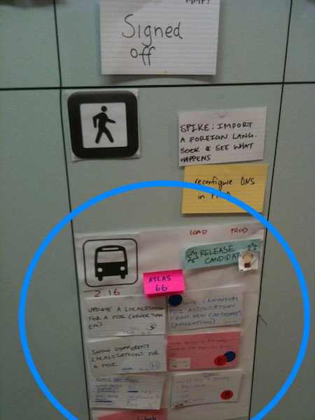

--- 
layout: /mdub/weblog/_article.html.haml
title: All aboard the "Release Bus"
published: Sep 12 2010, 22:00
...

<em>
Spoiler: A "Release Bus" groups story cards to create a tangible representation of what's going into a release.
</em>

These days, it's pretty common for software projects to have a "story wall", or "task board", which story cards track across as they progress from "written" to "done".  

In a recent project, we were doing exactly that, but were having problems with the "done" cards, which ended up swimming around together in a column labelled "Signed Off".
It was difficult to see which of the signed off cards would be included in next release.
It was unclear when cards should be removed from the wall.
And, some cards didn't even involve software changes, e.g. where we were "spiking", doing some analysis of production data, or tweaking the production infrastructure.

Solution: We created a "Release Bus" — an A3 sheet of paper, onto which releasable cards are placed once they're signed off.  This simple sheet of paper suddenly made the release such more tangible.  In essence, it's the release-level equivalent of a story card.

It also provides a handy place to track other aspects of the release, like the release number, and a candidate build number.  We typically have a "release bitch" [sic], responsible for tracking the release into production, and the bus was a handy place to capture that, too.  

Best of all: as the release moves off through the final stages of pre-release testing, and into production, we have a single artifact that we can move off into an archive, rather than dealing with individual story cards.

In the picture above, you'll also notice a "pedestrian" area; we use this for those operational or investigative cards that didn't result in releasable software.

All in all, a useful wee innovation.
