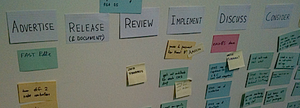

--- 
layout: /mdub/weblog/_article.html.haml
title: Flipping the card wall
...

Most agile software development projects have a "card wall", with each card representing a story, or a task, or some other unit of work.  

Typically, the wall is arranged in columns with labels such as: *In Analysis*, *Ready for Dev*, *Developing*, *Ready for Test*, *Testing*, and eventually, *Done*.  And typically, cards progress across the wall from left to right.  The labels vary, a lot, but the left-to-right thing is fairly standard.

The thing is, I've noticed a tendency for people to concentrate on the leftmost stuff first. That is, your focus drifts towards work that is in-progress, or not yet begun, partly because its the first thing to catch your eye.  I argue that this increases the risk of work over in the right-most "almost done" columns languishing, incomplete and undelivered, while the team moves on to other things.

So, on my current project, I convinced the team to try something different.  Observe ...

  

The key difference here is that cards progress from *right-to-left*, rather than the other way around.  Work that is almost finished is on the left, while stuff we haven't started yet is way over on the right.  As I suspected, this orientation encourages people (including me) to think about the things that are almost-but-not-quite done, first.  My hope is that this will help us *pull* (as opposed to *push*) work through our process, and reduce "inventory" at each step.

At the same time, the labels on our columns are all verbs, making it very clear what needs to happen with that card next.  These, then, are our columns:

- **Advertise**: If we've recently released useful new features, our quickest path to providing value is to get people using them.  We hold a "showcase" every two weeks or so, but often use other channels (email, internal blog, wandering over) to promote our wares, as well.

- **Release** (and Document): Much of our work needs to be made available explicitly, by upgrading a network service, or publishing a new version of a software component.  We try to do this as soon as possible once we consider it "done".  Part of releasing is making sure that suitable documentation is available, if necessary.

- **Review**: If someone has recently completed a task, we want someone else to review it be we consider it "good to go".  Sometimes another member of the team can do it, but usually we'll ask an end-user to give it the seal of approval (or not, as the case may be).  Getting this feedback is more important than building new stuff.

- **Implement**: Assuming we've cleared out the previous couple of columns, we can do some actual programming (with frequent pauses to drink coffee and/or insult each other's choice of text editor).

- **Discuss**: 

- **Consider**:
