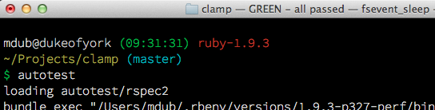

---
layout: /mdub/weblog/_article.html.haml
title: Fun with Autotest hooks
published: 5 Jun 2013 10:40
...

I've been doing more tight-feedback-loop unit-testing in Ruby recently, and find myself using `autotest` (from the [ZenTest](https://github.com/seattlerb/zentest) suite) a lot.

One of the great things about `autotest` is it's hook mechanism, which allows you to hang behaviour on the passing or failing of a test suite.  Many people have written hooks that publish test results via a notification mechanism such as Growl. I wrote a similar one that signals the state of the test-suite via the title of the terminal window running `autotest`:

    def set_title(title)
      if ENV["TERM"] =~ /^xterm/
        puts "\e]0;#{title}\007"
      end
    end

    Autotest.add_hook(:green) do
      set_title "GREEN - all passed"
    end

    Autotest.add_hook(:red) do |autotest|
      set_title "RED - #{autotest.files_to_test.size} failure"
    end

<figure>

</figure>

Also, I have a tendency to checkpoint with "`git add`" whenever the tests pass.  That's easily delegated to `autotest`:

    Autotest.add_hook(:green) do
      checkpoint_command = "git add ."
      puts "AUTOTEST_CHECKPOINT> #{checkpoint_command}"
      system(checkpoint_command)
    end

Does anyone have other useful hooks to share?
