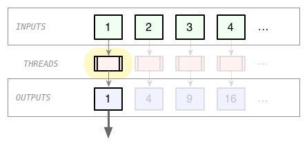

---
layout: /mdub/weblog/_article.html.haml
title: Multi-threaded processing with lazy enumerables
published: 23 May 2013, 23:30
...

A project I'm working on at the moment involves trawling a large collection (millions) of S3 objects, and I wanted to parallelize the processing across multiple threads.

As it happens, it's actually pretty easy to process a Ruby collection using multiple Threads:

<pre><code class="ruby">inputs = [1, 2, 3, 4, 5]
threads = inputs.collect { |i| Thread.new { i * i } }
outputs = threads.collect { |thread| thread.join.value }
outputs #=> [1, 4, 9, 16, 25]
</code></pre>

The problem with this naive approach, though, is that you end up creating a Thread for each element of the collection, all at once. For large collections, that's a bad idea. Typically you want to limit the number of Threads you having running simultaneously.

<figure>

<figcaption>Figure 1: Thread explosion!</figcaption>
</figure>

We can fix the do-everything-at-once problem using lazy enumeration:

<pre><code class="ruby">require 'lazily' # or use Ruby 2

inputs = [1, 2, 3, 4, 5]
lazy_threads = inputs.lazily.collect { |i| Thread.new { i * i } } # lazy!
outputs = lazy_threads.collect { |thread| thread.join.value }
outputs.to_a #=> [1, 4, 9, 16, 25]
</code></pre>

Okay, but now we have the opposite problem: the worker Threads aren't created until immediately before their outputs are required, so we don't get any parallelization.

<figure>

<figcaption>Figure 2: Not really parallel</figcaption>
</figure>

So, what if we reintroduced _just a little_ eagerness?  Let's **prefetch** some of the Threads in the `lazy_threads` collection, before we actually need them:

<pre><code class="ruby">require 'lazily'

inputs = [1, 2, 3, 4, 5]
lazy_threads = inputs.lazily.collect { |i| Thread.new { i * i } }
prefetched_threads = lazy_threads.prefetch(2) # <- added magic
outputs = prefetched_threads.collect { |thread| thread.join.value }
outputs.to_a #=> [1, 4, 9, 16, 25]
</code></pre>

The implementation of `#prefetch` is pretty straightforward; it creates a lazy buffer in front of another lazy enumerable, which keeps itself full, as it feeds elements to it's consumer.

Bingo! Now we're starting a limited number of Threads in advance of needing their outputs.

<figure>

<figcaption>Figure 3: Antici........pation</figcaption>
</figure>

We can size the prefetch "window" to get some parallelization, without creating an explosion of Threads. Even better, we've managed to do it without involving tricksy multi-threading operators like `Mutex` or `Queue`. And, the collection of outputs is lazy, so we can use this approach to process large (even infinite?) collections.

This "sliding window" approach to multi-threading is implemented in my new gem, [Lazily](https://github.com/mdub/lazily), as `#in_threads`:

<pre><code class="ruby">require 'lazily'

inputs = [1, 2, 3, 4, 5]
outputs = inputs.lazily.in_threads(4) { |i| i * i }
outputs.to_a #=> [1, 4, 9, 16, 25]
</code></pre>

(Lazily is an implementation of Ruby2-like lazy Enumerables in pure Ruby. Give it a spin if you're eager to be lazy, and can't deploy to ruby-2.0.0).
